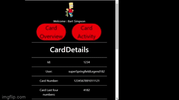

# reactCardDash

Client server application in where mock data comes in to display all of the user's and card's information.


## to get the repo:

```
git clone https://github.com/jolaya182/reactCardDash.git

```

To install:
```
npm  i
```

To run a production build:
```
npm run build
```

Finally go to the src folder: `reactCardDash`
open the `dist` folder and click on the `index.html` file

OR

To work in development mode, type:

Run the server:
```
npm run starts
```

Start the dev server:
```
npm start
```
Finally, open your webbrowser and type in this url: `http://localhost:8080/` 


## Design questions

```
How else might I have improved my solution given more time?
```

A way to have improved this application is by adopting a technology called 'immer'. This would allow the resting of objects to be much cleaner. Another point is to add some jest tests where I can check if the fetch API hook component I created is working well. In addition, I would have created an end-to-end test like puppeteer to check for the rendering of the form and data on the page.

```
Approximately how many hours did I spend on this challenge?
```
The time taken is approximately around 25 hours.

```
What did I find most interesting/rewarding about this challenge?
````
The most interesting part of the challenge was finding out a way to display an imense amount of data to the client because I wanted to reduce the amount of data the browser had to keep. I solve this by sending the data by chucnks using a pagination feature. This keeps memory load low. Another interesting part was working with webpack 5, react router browserouter, immer, and stateContext. I was investigating ways to better execute this project and found that my wepack 4 has become more outdated than I had expected so I had to quickly updated myself with the new webpack 5. I learned that browserrouter is still having some bugs to hash out. So instead I used Hashrouter which solves the 404 issues with webpack. I then found immer within my search and although I wish had more time to implement it, I will use this in the future to make my code even more cleaner.

What I found most rewarding was the simplicity of the instructions because that allowed me to reach a good speed to which I was able to execute my design and finish the challenge. I have lessened the time it takes to complete a project by writing out and drawing all my full stack structures. Also, I was very happy to have come across Immer! 

```
What did I find least interesting/rewarding about this challenge?
```
The least interesting part for me was having to display the metrics. I think given more time I could have created some charts for clients to better see the metrics. In addition, I was a bit sad that I was not find out why browserouter is not working well with webpack. I had questions, and due to the time constraint I did not investigate any further because I was able to solve this issue using the hash router. 
I honestly don't have much to say about feeling least rewarded. What I would say is that maybe I would have felt more rewarded if I had gained some insight as to what other metrics the customers are needing on their dashboards for the future.

